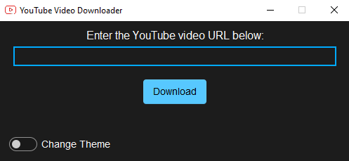

# YouTube Video Downloader

<center>
  
</center>
</br>

This project contains a simple YouTube video downloader application using Python. Users can download videos by entering a YouTube video URL through the application.

## Installation

You can install project dependencies using the following command:

```bash
pip install -r requirements.txt
```

## Usage

To run the application, you can use the following command:

```bash
python youtube.py
```

## Features
- Ability to download YouTube videos in high resolution.
- User-friendly graphical interface.
- Theme switching feature.

## Contributing
If you want to contribute to the project, please open a pull request. Your contributions are welcome!
